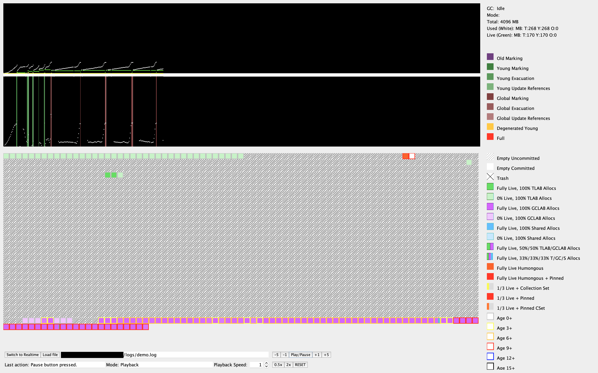

# Shenandoah Visualizer

Shenandoah Visualizer is a low-level tool to visualize the internal state of
[Shenandoah GC](https://wiki.openjdk.java.net/display/Shenandoah). It relies on
jvmstat interface to pull the data from the live JVM.

## Building

Build as any Maven-driven Java project:

    $ mvn clean verify

...or pick up the binary build [from here](https://builds.shipilev.net/shenandoah-visualizer/).

## Usage

#### Realtime
*Step 1.* Start target JVM with these additional flags:

    $ java -XX:+UsePerfData -XX:+UnlockExperimentalVMOptions -XX:+ShenandoahRegionSampling ...

*Step 2.* Figure out the target JVM PID:

    $ jps

*Step 3a.* Run the Visualizer; Visualizer will attempt to detect a JVM running Shenandoah:
    
    $ java -jar visualizer.jar

*Step 3b.* Optionally attach the Visualizer using the -vm flag:

    $ java -Xbootclasspath/p:<path-to-tools.jar> -jar visualizer.jar -vm local://<pid>

`tools.jar` can usually be found at `$JAVA_HOME/lib`

#### Saving JVM session
*Step 1.* Add this additional flag to an active JVM running Shenandoah:

    $ -XX:+ShenandoahLogRegionSampling

*Step 2.* Optionally specify the file path to save the session's log file using the ShenandoahRegionSamplingFile flag:

    $ -XX:ShenandoahRegionSamplingFile=<file path>

#### Replaying JVM session
*Step 1.* Run the Visualizer using the -logFile flag:

    $ java -jar visualizer.jar -logFile <file path>
